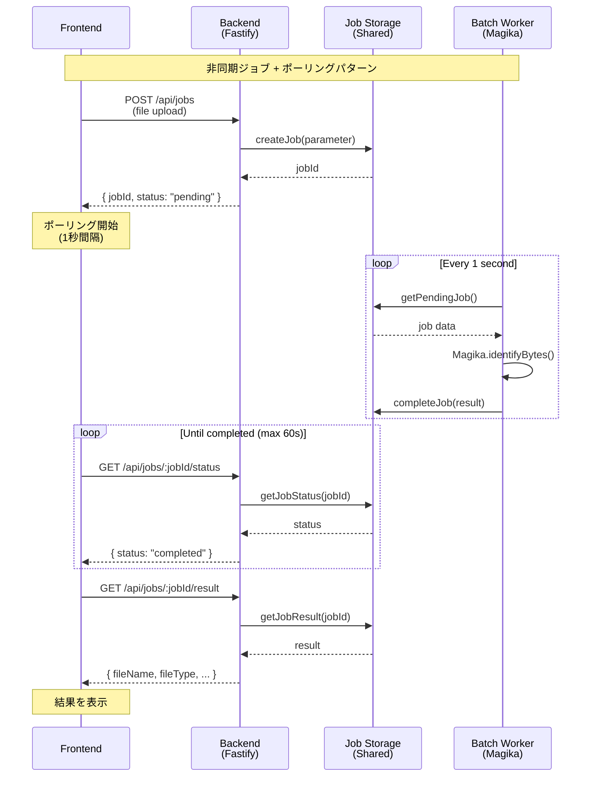
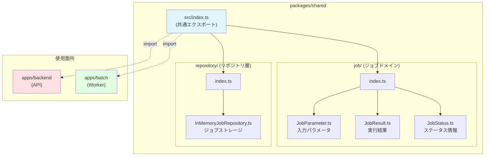
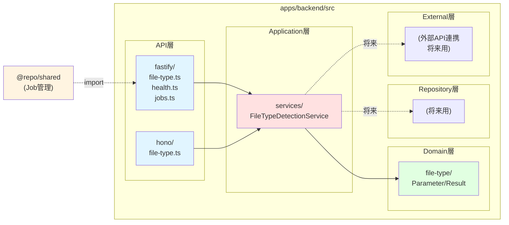

# File Type Detection Demo

TypeScript + Turborepo を使用したモダンな monorepo プロジェクトです。Nuxt 3（SPA/SSR/SSG）と Fastify + Hono バックエンドでファイルタイプ判定機能を実装した実践的なサンプルです。

## 🎯 プロジェクト構成

```
mono-repo-sample/
├── apps/
│   ├── frontend/     # Nuxt 3 フロントエンドアプリケーション (SPA/SSR/SSG)
│   ├── backend/      # Fastify + Hono APIサーバー + ライトDDD風アーキテクチャ
│   └── batch/        # バッチワーカー (非同期ジョブ処理)
├── packages/
│   ├── types/        # 共有型定義
│   ├── shared/       # 共有ドメインロジック (Job, Repository)
│   └── typescript-config/  # 共有 TypeScript 設定
└── turbo.json        # Turborepo 設定
```

## 🚀 技術スタック

### フロントエンド (apps/frontend)
- **Nuxt 3** - モダンな Vue.js フレームワーク
  - SPA モード (client-side only)
  - SSR モード (server-side rendering)
  - SSG モード (static site generation)
- **TypeScript** - 型安全性
- **Vue Router** - ルーティング

### バックエンド (apps/backend)
- **Fastify** - 高性能な Node.js Web フレームワーク
- **Hono + OpenAPI** - 軽量なAPI定義とドキュメント自動生成
- **Magika 1.0.0** - Google のファイルタイプ検出ライブラリ
- **@fastify/multipart** - ファイルアップロード処理
- **Zod** - スキーマバリデーション
- **TypeScript** - 型安全性
- **ライトDDD風アーキテクチャ** - Parameter/Result パターン

### バッチワーカー (apps/batch)
- **tsx** - TypeScript実行環境
- **Magika 1.0.0** - ファイルタイプ検出処理
- **非同期ジョブパターン** - ポーリング + ジョブキュー
- **@repo/shared** - バックエンドとの共有ドメインロジック

### 共通
- **Turborepo** - モノレポビルドシステム
- **pnpm** - 高速なパッケージマネージャー

## 📋 前提条件

- Node.js 20.x 以上
- pnpm 8.x 以上
- Docker & Docker Compose

## 🛠️ セットアップ

### 1. Dragonflyの起動（このプロジェクト専用）

```bash
# Docker Composeでドラゴンフライを起動（ポート6380）
sudo docker compose up -d

# 起動確認
sudo docker ps | grep dragonfly

# ログ確認
sudo docker logs mono-repo-dragonfly
```

### 2. 依存関係のインストール

```bash
pnpm install
```

### 2. 開発サーバーの起動

すべてのアプリケーションを同時に起動:

```bash
pnpm dev
```

個別に起動する場合:

```bash
# フロントエンド (Nuxt) - http://localhost:3000
cd apps/frontend
pnpm dev

# 統合APIサーバー (Fastify + Hono) - http://localhost:3002
cd apps/backend
pnpm dev

# バッチワーカー (非同期ジョブ処理)
cd apps/batch
pnpm dev
```

> **重要**: 
> - ファイルタイプ検出機能を使用する場合、**Redis/Dragonfly**、**Backend**、**Batch Worker** の3つが必要です
> - Redis/Dragonflyが起動していない場合、ジョブの保存・取得ができません
> - デフォルトで `localhost:6379` に接続します（環境変数 `REDIS_HOST`, `REDIS_PORT` で変更可能）

## 🌐 アクセス URL

- **Dragonfly (このプロジェクト専用)**: localhost:6380
  - ジョブデータの共有ストレージ（プロセス間通信）
  - Backend と Batch Worker 間でジョブ情報を共有
  - 他のプロジェクトのRedis(6379)とは独立
- **フロントエンド**: http://localhost:3000
  - ダッシュボード: http://localhost:3000/dashboard
  - SPA モード: http://localhost:3000/dashboard/app-spa
  - SSR モード: http://localhost:3000/dashboard/app-ssr
  - SSG モード: http://localhost:3000/dashboard/app-ssg
  - **外部アクセス**: `0.0.0.0:3000` でリッスン（同一ネットワーク内のIPアドレスでアクセス可能）
- **バックエンド**: http://localhost:3002
  - API ドキュメント (Swagger): http://localhost:3002/docs
  - OpenAPI Spec: http://localhost:3002/openapi.json
  - ヘルスチェック: http://localhost:3002/health
  - API Root: http://localhost:3002/
  - **外部アクセス**: `0.0.0.0:3002` でリッスン（同一ネットワーク内のIPアドレスでアクセス可能）

## 📚 API エンドポイント

### バックエンド (port 3002)

#### 非同期ジョブ管理 API
- `POST /api/jobs` - ファイルタイプ判定ジョブの投入
  - Content-Type: `multipart/form-data`
  - フィールド: `file` (バイナリファイル)
  - レスポンス:
    ```json
    {
      "jobId": "550e8400-e29b-41d4-a716-446655440000",
      "status": "pending"
    }
    ```

- `GET /api/jobs/:jobId/status` - ジョブステータスの確認
  - レスポンス:
    ```json
    {
      "jobId": "550e8400-e29b-41d4-a716-446655440000",
      "status": "completed",
      "createdAt": "2024-01-01T00:00:00.000Z",
      "updatedAt": "2024-01-01T00:00:05.000Z"
    }
    ```
  - ステータス: `pending` | `processing` | `completed` | `failed`

- `GET /api/jobs/:jobId/result` - ジョブ結果の取得
  - レスポンス:
    ```json
    {
      "fileName": "example.pdf",
      "fileType": "pdf",
      "isText": false,
      "score": 0.99,
      "scorePercent": 99,
      "description": "PDF document",
      "group": "document",
      "mimeType": "application/pdf",
      "extension": "pdf"
    }
    ```

#### File Type Detection - Fastify版 (レガシー)
- `POST /api/detect-file-type` - ファイルタイプ判定（同期版・デバッグ用）
  - Content-Type: `multipart/form-data`
  - フィールド: `file` (バイナリファイル)
  - レスポンス:
    ```json
    {
      "fileName": "example.pdf",
      "fileType": "pdf",
      "isText": false,
      "score": 0.99,
      "scorePercent": "99%",
      "description": "Detected as pdf file",
      "group": "document",
      "mimeType": "application/pdf",
      "extension": "pdf"
    }
    ```

#### レスポンスプロパティ

| プロパティ | 型 | 説明 |
|----------|-----|------|
| `fileName` | string | アップロードされたファイル名 |
| `fileType` | string | 検出されたファイルタイプ（例: pdf, png, javascript） |
| `isText` | boolean | テキストファイルかどうか |
| `score` | number | 信頼度スコア（0-1の範囲） |
| `scorePercent` | string | 信頼度スコアのパーセンテージ表示 |
| `description` | string | ファイルタイプの説明文 |
| `group` | string | ファイルグループ（例: document, code, image） |
| `mimeType` | string | MIMEタイプ（例: application/pdf, image/png） |
| `extension` | string | 推奨される拡張子 |

#### File Type Detection - Hono版 (OpenAPI)
- `POST /api/file-type/detect-file-type` - ファイルタイプ判定（Hono + OpenAPI実装）
  - 同じファイルタイプ検出サービスを呼び出し
  - OpenAPI仕様でドキュメント化
  - Swagger UIで対話的にテスト可能

## 🏗️ 非同期ジョブアーキテクチャ

このプロジェクトは**非同期ジョブ + ポーリングパターン**を採用し、ファイルタイプ検出処理をバックグラウンドで実行します。

### アーキテクチャ図



### フロー説明

1. **ジョブ投入**: フロントエンドがファイルを`POST /api/jobs`で送信
2. **即時レスポンス**: バックエンドが`jobId`を返却し、ジョブを`pending`状態で保存
3. **ポーリング開始**: フロントエンドが1秒間隔で`GET /api/jobs/:jobId/status`を実行
4. **バッチ処理**: バッチワーカーが1秒間隔でペンディングジョブをチェック
5. **ファイル解析**: ワーカーがMagikaでファイルタイプを判定
6. **結果保存**: ジョブステータスを`completed`に更新し、結果を保存
7. **結果取得**: フロントエンドがステータス`completed`を検出し、`GET /api/jobs/:jobId/result`で結果を取得

### 共有パッケージ構成



### 利点

- **レスポンシブUI**: ファイルアップロード後すぐに操作可能
- **スケーラビリティ**: バッチワーカーを複数起動して並列処理可能
- **疎結合**: API層とバッチ層が独立して動作
- **エラーハンドリング**: ジョブの失敗を追跡・再試行可能

## 🏗️ ライトDDD風 アーキテクチャ (Backend)

バックエンドはシンプルなライトDDD風の構成で、Parameter/Resultクラスによる明確なデータフローを実現しています:



### アーキテクチャの特徴

- **シンプルさ重視**: interfaceを排除し、Parameter/Resultクラスのみで構成
- **domain層**: 各機能のParameter（入力）とResult（出力）クラスを格納
- **application層**: ビジネスロジックとデータ操作を含むServiceクラス
  - FastifyとHonoの両方から同じServiceを呼び出し
- **repository層**: データストア実装用ディレクトリ（将来の拡張用）
- **api層**: FastifyとHonoのルート定義を分離
  - Fastify: 高性能なルーティング
  - Hono: OpenAPIドキュメント自動生成
- **external層**: 外部API連携用ディレクトリ（将来の拡張用）

### DDD パターンの詳細

このバックエンドは、ドメイン駆動設計（DDD）の原則に基づいたライトDDD風アーキテクチャを採用しています。

#### レイヤー構造

```
apps/backend/src/
├── domain/              # ドメイン層 - ビジネスロジックの中核
│   ├── entities/       # エンティティ（将来用）
│   ├── value-objects/  # 値オブジェクト（将来用）
│   ├── file-type/      # ファイルタイプ判定ドメイン
│   └── order/          # 注文管理ドメイン
│
├── application/        # アプリケーション層 - ユースケース
│   └── services/       # アプリケーションサービス
│       ├── FileTypeDetectionService.ts
│       └── OrderService.ts
│
├── api/                # API層（インフラストラクチャ層の一部）
│   ├── fastify/        # Fastifyルート定義
│   └── hono/           # Honoルート定義
│
├── repository/         # リポジトリ層（将来用）
└── external/           # 外部連携層（将来用）
```

#### 依存関係のルール

```
API層 → Application層 → Domain層
 ↓          ↓             ↓
実装詳細  ユースケース  ビジネスロジック
```

- **Domain層**: 他の層に依存しない、ビジネスロジックの中核
- **Application層**: Domain層にのみ依存、ユースケースを実装
- **API層**: すべての層に依存可能、HTTPリクエスト/レスポンス処理

#### DDD の主要パターン

##### 1. Parameter/Result パターン（値オブジェクトの簡易版）

```typescript
// Parameter（入力）
export class DetectFileTypeParameter {
  constructor(
    public readonly fileData: Uint8Array,
    public readonly fileName: string
  ) {}
}

// Result（出力）
export class DetectFileTypeResult {
  constructor(
    public readonly fileName: string,
    public readonly fileType: string,
    public readonly isText: boolean,
    public readonly score: number,
    // ...
  ) {}
}
```

**特徴**:
- イミュータブル（readonly）
- バリデーションロジックを含む
- 型安全なデータ受け渡し

##### 2. Application Service パターン

```typescript
export class FileTypeDetectionService {
  async detectFileType(
    parameter: DetectFileTypeParameter
  ): Promise<DetectFileTypeResult> {
    // ビジネスロジックの実装
    // 外部ライブラリ（Magika）の呼び出し
    // Resultオブジェクトの生成
  }
}
```

**責任**:
- ユースケースの実行
- ドメインオブジェクトの組み合わせ
- トランザクション境界の管理

##### 3. Repository パターン（将来の拡張用）

```typescript
// 例: 将来的なデータ永続化
interface IOrderRepository {
  findById(id: OrderId): Promise<Order | null>
  save(order: Order): Promise<void>
}

class InMemoryOrderRepository implements IOrderRepository {
  // メモリ内データストア実装
}
```

**利点**:
- データアクセスの抽象化
- テストが容易（モック化可能）
- 実装の切り替えが簡単（メモリ → DB）

#### ベストプラクティス

1. **ドメインロジックはDomain層に集中**
   - API層やApplication層にビジネスロジックを漏らさない
   - Parameter/Resultクラスでドメイン知識をカプセル化

2. **不変性を保つ**
   - Parameter/Resultクラスは `readonly` で定義
   - 予測可能な動作とバグの削減

3. **明示的な型を使用**
   - プリミティブ型の代わりにParameter/Resultクラスを使用
   - 例: `string` → `DetectFileTypeParameter`

4. **単一責任の原則**
   - 各Serviceは1つのユースケースに集中
   - ファイルタイプ判定、注文管理など機能ごとに分離

5. **テスタビリティ**
   - Serviceクラスは依存を注入可能に設計
   - モックを使用した単体テストが容易

#### 拡張のガイドライン

##### 新しい機能の追加

1. `domain/<feature>/` に Parameter/Result クラスを作成
2. `application/services/` に Service クラスを作成
3. `api/fastify/` または `api/hono/` にルート定義を追加
4. Service を index.ts で登録

##### データベースへの移行

1. `repository/` に Repository 実装を作成
2. Service に Repository を注入
3. Domain層とApplication層は変更不要

##### 外部API連携の追加

1. `external/` にクライアント実装を作成
2. Service から外部クライアントを呼び出し
3. エラーハンドリングとリトライロジックを実装

---

## 📖 実装ガイド

### アーキテクチャ概要

このプロジェクトは **Turborepo** によるモノレポ構成で、以下の原則に基づいて設計されています:

1. **疎結合**: 各アプリケーションは独立して動作可能
2. **単一責任**: 各層は明確な責任を持つ
3. **DRY原則**: 共有ロジックは `packages/shared` に配置
4. **型安全性**: TypeScript の厳格な型チェックを活用
5. **シンプルさ**: Interface を排除し、Parameter/Result クラスのみで構成

### 非同期ジョブパターンの詳細

#### ジョブのライフサイクル

ジョブは以下のステータスを持ちます:

```typescript
type JobStatusType = 'pending' | 'processing' | 'completed' | 'failed'
```

- **pending**: ジョブが投入され、処理待ち
- **processing**: バッチワーカーが処理中
- **completed**: 処理が正常に完了
- **failed**: 処理が失敗

#### ポーリング間隔

- **フロントエンド → Backend**: 1秒間隔でステータスポーリング（最大60秒）
- **Batch Worker → Job Storage**: 1秒間隔でペンディングジョブをチェック

#### データの保持期間

- ジョブは作成から **24時間** 保持
- バッチワーカーが **1時間ごと** に古いジョブをクリーンアップ

### 共有パッケージの設計詳細

#### packages/shared の役割

Backend と Batch Worker 間でドメインロジックを共有するための専用パッケージです。

#### クラス設計

##### 1. JobParameter (入力)

```typescript
export class JobParameter {
  constructor(
    public readonly fileData: Uint8Array,
    public readonly fileName: string
  ) {}
}
```

**責任**: ジョブ実行に必要な入力パラメータを保持

##### 2. JobResult (出力)

```typescript
export class JobResult {
  constructor(
    public readonly fileName: string,
    public readonly fileType: string,
    public readonly isText: boolean,
    public readonly score: number,
    public readonly scorePercent: string,
    public readonly description: string,
    public readonly group: string,
    public readonly mimeType: string,
    public readonly extension: string
  ) {}
}
```

**責任**: ジョブ実行結果を保持（Magika の解析結果）

##### 3. JobStatus (状態管理)

```typescript
export type JobStatusType = 'pending' | 'processing' | 'completed' | 'failed'

export class JobStatus {
  constructor(
    public readonly jobId: string,
    public readonly status: JobStatusType,
    public readonly createdAt: Date,
    public readonly updatedAt: Date,
    public readonly error?: string
  ) {}
}
```

**責任**: ジョブのステータス情報を保持

##### 4. InMemoryJobRepository (ストレージ)

```typescript
class InMemoryJobRepository {
  private jobs: Map<string, JobData> = new Map()

  createJob(parameter: JobParameter): string
  getJobStatus(jobId: string): JobStatus | null
  getJobResult(jobId: string): JobResult | null
  getPendingJob(): JobData | null
  completeJob(jobId: string, result: JobResult): void
  failJob(jobId: string, error: string): void
  cleanupOldJobs(): void
}

export const jobRepository = new InMemoryJobRepository()
```

**責任**: 
- ジョブの CRUD 操作
- ペンディングジョブの取得（バッチ用）
- 古いジョブのクリーンアップ

**重要**: シングルトンインスタンスとしてエクスポート（Backend と Batch で同一インスタンスを共有）

---

## 🛠️ 実装ルール

### 1. パッケージ管理

#### ワークスペース設定

```yaml
# pnpm-workspace.yaml
packages:
  - 'apps/*'
  - 'packages/*'
```

#### 依存関係の追加

共有パッケージを使用するアプリケーションの `package.json`:

```json
{
  "dependencies": {
    "@repo/shared": "workspace:*"
  }
}
```

### 2. TypeScript 設定

#### packages/shared/tsconfig.json

```json
{
  "extends": "@repo/typescript-config/base.json",
  "compilerOptions": {
    "outDir": "dist",
    "rootDir": "src",
    "declaration": true,
    "declarationMap": true,
    "lib": ["ES2015"],
    "types": ["node"],
    "module": "ESNext",
    "moduleResolution": "bundler"
  },
  "include": ["src/**/*"],
  "exclude": ["node_modules", "dist"]
}
```

**重要ポイント**:
- `lib: ["ES2015"]` - Map, Promise などの ES2015 機能を有効化
- `types: ["node"]` - Node.js 型定義（crypto, process など）
- `moduleResolution: "bundler"` - tsx/tsup などのバンドラーに対応

#### apps/batch/tsconfig.json

```json
{
  "extends": "@repo/typescript-config/node.json",
  "compilerOptions": {
    "module": "ESNext",
    "moduleResolution": "bundler",
    "outDir": "dist",
    "rootDir": "src"
  },
  "include": ["src/**/*"],
  "exclude": ["node_modules", "dist"]
}
```

**重要**: `moduleResolution: "bundler"` により `@repo/shared` のサブパスエクスポートが正しく解決されます。

### 3. エクスポート設計

#### packages/shared/package.json

```json
{
  "name": "@repo/shared",
  "type": "module",
  "main": "./src/index.ts",
  "types": "./src/index.ts",
  "exports": {
    ".": "./src/index.ts",
    "./job": "./src/job/index.ts",
    "./repository": "./src/repository/index.ts"
  }
}
```

**推奨**: メインエクスポート (`.`) を使用:

```typescript
// Good
import { jobRepository, JobResult } from '@repo/shared'

// Avoid (サブパスは型解決の問題が発生しやすい)
import { jobRepository } from '@repo/shared/repository'
```

### 4. Backend API 実装

#### POST /api/jobs (ジョブ投入)

```typescript
import multipart from '@fastify/multipart'
import { jobRepository, JobParameter } from '@repo/shared'

export const jobRoutes: FastifyPluginAsync = async (fastify) => {
  fastify.register(multipart)

  fastify.post('/jobs', async (request, reply) => {
    const data = await request.file()
    if (!data) {
      return reply.status(400).send({ error: 'No file uploaded' })
    }

    const fileData = await data.toBuffer()
    const parameter = new JobParameter(new Uint8Array(fileData), data.filename)
    const jobId = jobRepository.createJob(parameter)

    return reply.status(202).send({ jobId, status: 'pending' })
  })
}
```

#### GET /api/jobs/:jobId/status (ステータス確認)

```typescript
fastify.get('/jobs/:jobId/status', async (request, reply) => {
  const { jobId } = request.params as { jobId: string }
  const status = jobRepository.getJobStatus(jobId)

  if (!status) {
    return reply.status(404).send({ error: 'Job not found' })
  }

  return reply.send(status)
})
```

#### GET /api/jobs/:jobId/result (結果取得)

```typescript
fastify.get('/jobs/:jobId/result', async (request, reply) => {
  const { jobId } = request.params as { jobId: string }
  
  const status = jobRepository.getJobStatus(jobId)
  if (!status) {
    return reply.status(404).send({ error: 'Job not found' })
  }

  if (status.status !== 'completed') {
    return reply.status(400).send({ 
      error: 'Job not completed',
      status: status.status 
    })
  }

  const result = jobRepository.getJobResult(jobId)
  return reply.send(result)
})
```

### 5. Batch Worker 実装

#### apps/batch/src/worker.ts

```typescript
import { jobRepository, JobResult } from '@repo/shared'
import { Magika } from 'magika'

let magikaInstance: Magika | null = null

async function initializeMagika(): Promise<void> {
  if (!magikaInstance) {
    console.log('Initializing Magika...')
    magikaInstance = await Magika.create()
    console.log('Magika initialized successfully')
  }
}

async function processJobs() {
  const job = jobRepository.getPendingJob()
  if (!job) return

  console.log(`🔄 Processing job ${job.jobId}...`)

  try {
    if (!magikaInstance) {
      throw new Error('Magika not initialized')
    }

    const identifyResult = await magikaInstance.identifyBytes(job.parameter.fileData) as any
    const output = identifyResult.prediction?.output
    const scoreMap = identifyResult.prediction?.score || {}

    if (!output) {
      throw new Error('Failed to detect file type')
    }

    const score = scoreMap[output.label] ?? 0
    const scorePercent = `${Math.round(score * 100)}%`

    const jobResult = new JobResult(
      job.parameter.fileName,
      output.label || 'unknown',
      output.is_text || false,
      score,
      scorePercent,
      output.description || '',
      output.group || 'unknown',
      output.mime_type || 'application/octet-stream',
      Array.isArray(output.extensions) ? output.extensions.join(', ') : output.extension || ''
    )

    jobRepository.completeJob(job.jobId, jobResult)
    console.log(`✅ Job ${job.jobId} completed successfully`)
  } catch (error) {
    const errorMessage = error instanceof Error ? error.message : String(error)
    console.error(`❌ Job ${job.jobId} failed:`, errorMessage)
    jobRepository.failJob(job.jobId, errorMessage)
  }
}

async function startWorker() {
  console.log('🚀 Batch worker started')
  await initializeMagika()

  // ジョブポーリング (1秒間隔)
  setInterval(async () => {
    try {
      await processJobs()
    } catch (error) {
      console.error('Worker error:', error)
    }
  }, 1000)

  // 古いジョブのクリーンアップ (1時間間隔)
  setInterval(() => {
    console.log('🧹 Cleaning up old jobs...')
    jobRepository.cleanupOldJobs()
  }, 60 * 60 * 1000)

  console.log(`⏱️  Polling interval: 1000ms`)
}

startWorker().catch((error) => {
  console.error('Failed to start worker:', error)
  process.exit(1)
})
```

**重要ポイント**:
- Magika の型定義が不完全なため、`as any` でキャスト
- `output.is_text` (スネークケース) と `output.extensions` (配列) に注意
- エラーハンドリングで `failJob()` を呼び出し

### 6. Frontend 実装

#### ジョブ投入 → ポーリング → 結果取得

```typescript
const handleSubmit = async () => {
  if (!selectedFile.value) return
  
  loading.value = true
  error.value = null
  result.value = null
  
  try {
    // Step 1: ジョブ投入
    const formData = new FormData()
    formData.append('file', selectedFile.value)
    
    const submitResponse = await fetch(`${apiBase}/api/jobs`, {
      method: 'POST',
      body: formData
    })
    
    if (!submitResponse.ok) {
      throw new Error(`ジョブ投入失敗: ${submitResponse.status}`)
    }
    
    const { jobId } = await submitResponse.json()
    
    // Step 2: ポーリング (最大60秒)
    const maxRetries = 60
    for (let i = 0; i < maxRetries; i++) {
      await new Promise(resolve => setTimeout(resolve, 1000))
      
      const statusResponse = await fetch(`${apiBase}/api/jobs/${jobId}/status`)
      if (!statusResponse.ok) {
        throw new Error(`ステータス確認失敗: ${statusResponse.status}`)
      }
      
      const { status } = await statusResponse.json()
      
      if (status === 'completed') {
        // Step 3: 結果取得
        const resultResponse = await fetch(`${apiBase}/api/jobs/${jobId}/result`)
        if (!resultResponse.ok) {
          throw new Error(`結果取得失敗: ${resultResponse.status}`)
        }
        
        result.value = await resultResponse.json()
        return
      } else if (status === 'failed') {
        const statusData = await statusResponse.json()
        throw new Error(statusData.error || 'ジョブが失敗しました')
      }
    }
    
    throw new Error('タイムアウト: ジョブ処理に時間がかかりすぎています')
  } catch (err: any) {
    error.value = `エラーが発生しました: ${err.message || String(err)}`
  } finally {
    loading.value = false
  }
}
```

### 7. Turborepo 設定

#### turbo.json

```json
{
  "$schema": "https://turbo.build/schema.json",
  "globalDependencies": ["**/.env.*local"],
  "pipeline": {
    "build": {
      "dependsOn": ["^build"],
      "outputs": ["dist/**", ".next/**", ".nuxt/**", ".output/**"]
    },
    "dev": {
      "cache": false,
      "persistent": true
    },
    "backend#dev": {
      "cache": false,
      "persistent": true
    },
    "batch#dev": {
      "cache": false,
      "persistent": true
    },
    "frontend#dev": {
      "cache": false,
      "persistent": true
    }
  }
}
```

**重要**: 
- `persistent: true` - サーバーなど長時間実行されるタスク
- `cache: false` - dev モードはキャッシュを無効化

---

## 🔄 再現手順

このセクションでは、プロジェクトをゼロから再現するための詳細な手順を記載しています。

### ステップ1: プロジェクトセットアップ

```bash
# Turborepo プロジェクト作成
npx create-turbo@latest

# 必要なディレクトリ作成
mkdir -p apps/batch/src
mkdir -p packages/shared/src/job
mkdir -p packages/shared/src/repository
```

### ステップ2: 共有パッケージ作成

```bash
cd packages/shared
```

#### package.json

```json
{
  "name": "@repo/shared",
  "version": "0.0.0",
  "private": true,
  "type": "module",
  "main": "./src/index.ts",
  "types": "./src/index.ts",
  "exports": {
    ".": "./src/index.ts",
    "./job": "./src/job/index.ts",
    "./repository": "./src/repository/index.ts"
  },
  "scripts": {
    "build": "tsc",
    "dev": "tsc --watch"
  },
  "devDependencies": {
    "@repo/typescript-config": "workspace:*",
    "@types/node": "^20.10.0",
    "typescript": "^5.9.3"
  }
}
```

#### 各ファイルの作成

`src/job/JobParameter.ts`, `src/job/JobResult.ts`, `src/job/JobStatus.ts`, `src/job/index.ts`, `src/repository/InMemoryJobRepository.ts`, `src/repository/index.ts`, `src/index.ts` を上記のクラス設計に従って作成します。

### ステップ3: バッチワーカー作成

```bash
cd apps/batch
```

`package.json`, `tsconfig.json`, `src/worker.ts` を上記の実装例に従って作成します。

### ステップ4: Backend に Job API 追加

```bash
cd apps/backend
```

`package.json` に `@repo/shared` を追加し、`src/api/fastify/jobs.ts` を作成、`src/index.ts` にルート登録します。

### ステップ5: Frontend 更新

3つのページ（SPA/SSR/SSG）を上記の実装例に従って更新します。

### ステップ6: 依存関係インストールと起動

```bash
# ルートディレクトリで
pnpm install

# 全体起動
pnpm dev
```

---

## 🐛 トラブルシューティング

### 問題1: `@repo/shared` が見つからない

**原因**: moduleResolution の設定が不適切

**解決策**: tsconfig.json に以下を追加

```json
{
  "compilerOptions": {
    "moduleResolution": "bundler"
  }
}
```

### 問題2: Map や Promise が見つからない

**原因**: lib 設定が不足

**解決策**: tsconfig.json に以下を追加

```json
{
  "compilerOptions": {
    "lib": ["ES2015"]
  }
}
```

### 問題3: crypto モジュールが見つからない

**原因**: @types/node がインストールされていない

**解決策**:

```bash
pnpm add -D @types/node
```

tsconfig.json に追加:

```json
{
  "compilerOptions": {
    "types": ["node"]
  }
}
```

### 問題4: Magika の型エラー

**原因**: Magika の型定義が不完全

**解決策**: `as any` でキャストして使用

```typescript
const identifyResult = await magikaInstance.identifyBytes(data) as any
const output = identifyResult.prediction?.output
```

---

## 📊 図表作成ルール (Mermaid)

### 基本方針

このプロジェクトのドキュメントでは、すべての図表を **Mermaid** 形式で記述します。

#### Mermaid を使用する理由

1. **バージョン管理**: テキストベースのため Git で差分管理が容易
2. **保守性**: コード変更に合わせて図も簡単に更新可能
3. **一貫性**: Markdown と統合され、同じファイル内で管理
4. **可読性**: GitHub、VS Code、多くのツールで自動レンダリング

### 図の種類と用途

#### 1. シーケンス図 (Sequence Diagram)

**用途**: API呼び出しフロー、非同期処理の流れ、時系列的なやり取り

**記述ルール**:
- `participant` で登場人物を定義（別名を付ける場合は `as` を使用）
- `->>` で同期呼び出し、`-->>` で返却
- `loop` でループ処理を表現
- `Note` でコメントを追加

#### 2. グラフ図 (Graph / Flowchart)

**用途**: ディレクトリ構造、依存関係、データフロー、階層構造

**記述ルール**:
- `graph TB` (Top to Bottom), `LR` (Left to Right) で方向指定
- `subgraph` でグループ化
- `-->` で実線矢印、`-.->` で点線矢印
- `[テキスト]` でノード、`style` で色指定
- `fill:#色コード` で背景色を設定

#### 3. クラス図 (Class Diagram)

**用途**: クラス設計、継承関係、インターフェース定義

**記述ルール**:
- `class クラス名` でクラス定義
- `+` public、`-` private、`#` protected
- `メソッド名(引数) 戻り値` でメソッド定義
- `-->` で依存関係、`--|>` で継承

### 色の使用ルール

```markdown
- Frontend: #e1f5ff (薄い青)
- Backend/API: #ffe1e1 (薄い赤)
- Batch/Worker: #e1ffe1 (薄い緑)
- Shared Package: #fff4e1 (薄い黄)
- Database/Storage: #f0e1ff (薄い紫)
```

### VS Code での Mermaid プレビュー

推奨拡張機能:
```bash
code --install-extension bierner.markdown-mermaid
code --install-extension tomoyukim.vscode-mermaid-editor
```

### 参考リンク

- [Mermaid 公式ドキュメント](https://mermaid.js.org/)
- [Mermaid Live Editor](https://mermaid.live/)
- [GitHub の Mermaid サポート](https://github.blog/2022-02-14-include-diagrams-markdown-files-mermaid/)

---## 🔧 ビルド

すべてのアプリケーションをビルド:

```bash
pnpm build
```

個別にビルド:

```bash
# フロントエンド
cd apps/frontend
pnpm build

# 統合APIサーバー
cd apps/backend
pnpm build
```

## 📝 型チェック

すべてのパッケージで型チェックを実行:

```bash
pnpm type-check
```

## 🎨 プロジェクトの特徴

### 1. Nuxt 3 レンダリングモード比較
- **SPA (Single Page Application)**: クライアント側のみでレンダリング、高速な画面遷移
- **SSR (Server-Side Rendering)**: サーバー側でレンダリング、SEO最適化とパフォーマンス向上
- **SSG (Static Site Generation)**: ビルド時に静的HTML生成、CDN配信に最適

### 2. ハイブリッドAPI構成
- **Fastify**: 高性能なルーティングとDDD実装
- **Hono + OpenAPI**: 軽量で柔軟なAPI定義とドキュメント自動生成
- 両方のフレームワークが同じアプリケーションサービスを呼び出す設計

### 3. Monorepo 構成
- Turborepo による高速なビルドとキャッシング
- ワークスペース間での型定義の共有
- 並列実行による効率的な開発体験

### 4. ライトDDD風アーキテクチャ
- Parameter/Resultクラスによる明確なデータフロー
- 層ごとの責務分離
- テスタブルで保守性の高い設計
- interfaceを使わないシンプルな実装

### 5. 型安全性
- TypeScript による厳格な型チェック
- Zod によるランタイムバリデーション（Hono版）
- 共有型定義によるフロントエンド・バックエンド間の一貫性

### 6. ファイルタイプ検出
- Google Magika ライブラリによる高精度な検出
- バイナリレベルでのファイル形式判定
- テキスト/バイナリ判定と信頼度スコア

### 7. API ドキュメント自動生成
- OpenAPI 3.1.0 による API 仕様の定義
- Swagger UI による対話的な API テスト
- Zod スキーマによる型安全なバリデーション

## 📦 パッケージ管理

このプロジェクトは pnpm ワークスペースを使用しています。

依存関係の追加:

```bash
# ルートに追加
pnpm add -w <package>

# 特定のワークスペースに追加
pnpm add <package> --filter frontend
pnpm add <package> --filter backend
```

## 🤝 開発のヒント

### 新しいページの追加 (Nuxt)
`apps/frontend/pages/` に `.vue` ファイルを作成するだけで自動的にルーティングが設定されます。

### レンダリングモードの指定
- **SPA**: `definePageMeta({ ssr: false })` を追加
- **SSR**: デフォルト設定（何も指定しない）
- **SSG**: `nuxt.config.ts` の `routeRules` で `prerender: true` を設定

### 新しい API エンドポイントの追加

#### ライトDDD風アーキテクチャ
1. `apps/backend/src/domain/<feature>/` にParameter/Resultクラスを作成
2. `apps/backend/src/application/services/` にServiceクラスを作成

#### Fastify版エンドポイント
3. `apps/backend/src/api/fastify/` に Fastify ルートを作成
4. `apps/backend/src/index.ts` でルートを登録

#### Hono版エンドポイント（OpenAPI対応）
3. `apps/backend/src/api/hono/` に Hono + OpenAPI ルートを作成
4. `apps/backend/src/index.ts` でルートを登録

**ポイント**: FastifyとHonoの両方が同じServiceクラスを呼び出すため、ビジネスロジックは一箇所に集約されます。

### デバッグ設定

VS Codeでのデバッグ設定は `.vscode/launch.json` に記載されています。

#### 利用可能なデバッグ設定

1. **Backend: Debug**
   - バックエンドをデバッグモードで起動
   - pnpm経由でbackendフィルターを使用して実行

2. **Backend: Attach**
   - 既に起動しているバックエンドプロセスにアタッチ
   - ポート9229で接続

3. **Frontend: Debug**
   - フロントエンドをChromeブラウザでデバッグ
   - `http://localhost:3000` に接続

4. **Backend: Debug (tsx watch)**
   - tsx watchモードでバックエンドをデバッグ
   - ファイル変更時に自動再起動

5. **All: Debug (Compound)**
   - Turborepoの全アプリを同時起動

6. **Full Stack Debug (Compound)**
   - バックエンドとフロントエンドを同時にデバッグ
   - フルスタック開発に最適

#### デバッグの開始方法

1. VS Codeのデバッグパネルを開く（`Ctrl+Shift+D` / `Cmd+Shift+D`）
2. ドロップダウンから使用する設定を選択
3. F5キーまたは再生ボタンをクリック
4. ブレークポイントを設定してコードをステップ実行

## 📄 ライセンス

MIT

## 🙏 参考資料

- [Turborepo Documentation](https://turbo.build/repo/docs)
- [Nuxt 3 Documentation](https://nuxt.com/)
- [Fastify Documentation](https://www.fastify.io/)
- [Hono Documentation](https://hono.dev/)
- [Google Magika](https://github.com/google/magika)
